# 🧠 RAG-Powered Document QA API

[](https://python.org)
[](https://fastapi.tiangolo.com)
[](https://github.com/facebookresearch/faiss)
[](https://ai.google.dev)

> 🚀 **State-of-the-art Retrieval-Augmented Generation (RAG) system** for intelligent document question answering with semantic search and AI-powered responses.

## 🌟 Features

### 🔥 Core Capabilities
- **📄 Multi-format Document Support**: PDF, DOCX, EML, TXT files
- **🧩 Intelligent Text Chunking**: Semantic-aware document segmentation
- **🔍 Vector-based Search**: FAISS-powered similarity search
- **🤖 AI-Powered Answers**: Google Gemini integration for natural responses
- **⚡ Production Ready**: Async processing, error handling, and monitoring

### 🛠️ Technical Highlights
- **Semantic Embeddings**: Sentence-BERT for meaningful text representations
- **Smart Chunking**: Preserves context while optimizing retrieval
- **Confidence Scoring**: Reliability metrics for generated answers
- **RESTful API**: Clean, documented endpoints with authentication
- **Persistent Storage**: Vector indices saved to disk for reuse

## 🏗️ Architecture

```mermaid
graph TD
    A[📄 Document Upload] --> B[🔤 Text Extraction]
    B --> C[✂️ Intelligent Chunking]
    C --> D[🧮 Vector Embeddings]
    D --> E[📊 FAISS Index]
    
    F[❓ User Question] --> G[🔍 Semantic Search]
    G --> E
    E --> H[📝 Relevant Chunks]
    H --> I[🤖 Gemini AI]
    I --> J[✨ Generated Answer]
```



## 🚀 Quick Start

### Prerequisites

- **Python 3.8+** 🐍
- **Google AI API Key** (Gemini) 🔑
- **4GB+ RAM** for embedding models 💾

### 1. Clone the Repository

```bash
git clone https://github.com/Thilakkumar-K/Docs_Gem.git
cd Docs Gem-master
```

### 2. Create Virtual Environment

```bash
# Create virtual environment
python -m venv venv

# Activate (Windows)
venv\Scripts\activate

# Activate (Linux/Mac)
source venv/bin/activate
```

### 3. Install Dependencies

```bash
# Install all required packages
pip install -r requirements.txt

# Download NLTK data (automatic on first run)
python -c "import nltk; nltk.download('punkt')"
```

### 4. Environment Setup

Create a `.env` file in the project root:

```env
# Google Gemini API Configuration
GEMINI_API_KEY=your_gemini_api_key_here

# API Security
VALID_TOKEN=5b6105937b7cc769e46557d6241353e800d99cb57def59fd962d1d6ea8fcf736

# Optional: Debug mode
DEBUG=True
ENVIRONMENT=development
```

> 🔑 **Get your Gemini API key**: Visit [Google AI Studio](https://makersuite.google.com/app/apikey)

### 5. Run the Application

```bash
# Development mode (with auto-reload)
python main.py

# Or using uvicorn directly
uvicorn main:app --reload --host 0.0.0.0 --port 8000
```

🎉 **Your API is now running at**: `http://localhost:8000`

## 📚 API Documentation

### Interactive Docs
- **Swagger UI**: `http://localhost:8000/api/v1/docs` 📋
- **ReDoc**: `http://localhost:8000/api/v1/redoc` 📖

### Core Endpoints

#### 🏥 Health Check
```bash
GET /api/v1/health
```

#### 📤 Upload Document
```bash
POST /api/v1/documents/upload
Authorization: Bearer YOUR_TOKEN
Content-Type: multipart/form-data

# Response
{
  "document_id": "uuid-here",
  "filename": "document.pdf",
  "status": "processed",
  "chunks_created": 25,
  "message": "Document processed successfully"
}
```

#### ❓ Ask Questions (Main Endpoint)
```bash
POST /api/v1/hackrx/run
Authorization: Bearer YOUR_TOKEN
Content-Type: application/json

{
  "documents": "https://example.com/document.pdf",  # OR
  "document_id": "uuid-from-upload",
  "questions": [
    "What is the main topic of this document?",
    "Summarize the key findings"
  ]
}
```

#### 🔍 Search Document Chunks
```bash
POST /api/v1/documents/{document_id}/search?query=your_search&top_k=5
Authorization: Bearer YOUR_TOKEN
```

## 💡 Usage Examples

### Python Client Example

```python
import requests
import json

# Configuration
API_BASE = "http://localhost:8000/api/v1"
TOKEN = "your_token_here"
HEADERS = {"Authorization": f"Bearer {TOKEN}"}

# Upload a document
with open("document.pdf", "rb") as f:
    response = requests.post(
        f"{API_BASE}/documents/upload",
        headers=HEADERS,
        files={"file": f}
    )
    doc_data = response.json()
    document_id = doc_data["document_id"]

# Ask questions
qa_request = {
    "document_id": document_id,
    "questions": [
        "What are the main findings?",
        "Who are the key stakeholders mentioned?"
    ]
}

response = requests.post(
    f"{API_BASE}/hackrx/run",
    headers=HEADERS,
    json=qa_request
)

answers = response.json()
for answer in answers["answers"]:
    print(f"Q: {answer['question']}")
    print(f"A: {answer['answer']}")
    print(f"Confidence: {answer['confidence']:.2f}")
    print("-" * 50)
```

### cURL Examples

```bash
# Health check
curl -X GET "http://localhost:8000/api/v1/health"

# Upload document
curl -X POST "http://localhost:8000/api/v1/documents/upload" \
  -H "Authorization: Bearer YOUR_TOKEN" \
  -F "file=@document.pdf"

# Ask questions with URL
curl -X POST "http://localhost:8000/api/v1/hackrx/run" \
  -H "Authorization: Bearer YOUR_TOKEN" \
  -H "Content-Type: application/json" \
  -d '{
    "documents": "https://example.com/document.pdf",
    "questions": ["What is this document about?"]
  }'
```

## ⚙️ Configuration

### Environment Variables

| Variable | Description | Default |
|----------|-------------|---------|
| `GEMINI_API_KEY` | Google Gemini API key | **Required** |
| `VALID_TOKEN` | API authentication token | See code |
| `DEBUG` | Enable debug mode | `False` |
| `ENVIRONMENT` | Runtime environment | `development` |

### Model Configuration

```python
# In main.py - Customize these settings
EMBEDDING_MODEL_NAME = "all-MiniLM-L6-v2"  # Embedding model
CHUNK_SIZE = 1000              # Characters per chunk
CHUNK_OVERLAP = 200            # Overlap between chunks
TOP_K_RETRIEVAL = 5            # Retrieved chunks per query
MAX_CONTEXT_LENGTH = 10000     # Max context for AI model
```

## 🧪 Testing

### Unit Tests
```bash
# Run all tests
python -m pytest tests/

# Run with coverage
python -m pytest tests/ --cov=main --cov-report=html
```

### API Testing
```bash
# Test embedding service
curl -X GET "http://localhost:8000/api/v1/test-embedding"

# Test Gemini integration
curl -X GET "http://localhost:8000/api/v1/test-gemini"

# Health check
curl -X GET "http://localhost:8000/api/v1/health"
```

## 📁 Project Structure

```
rag-document-qa-api/
├── 📂 uploads/              # Temporary file storage
├── 📂 vector_db/            # Persistent vector indices
│   └── 📂 {document_id}/
│       ├── index.faiss      # FAISS vector index
│       └── chunks.json      # Chunk metadata
├── 📂 tests/               # Test files
├── 📄 main.py              # Main application
├── 📄 requirements.txt     # Dependencies
├── 📄 .env                 # Environment variables
├── 📄 .gitignore          # Git ignore rules
└── 📄 README.md           # This file
```

## 🔧 Advanced Usage

### Custom Document Processing

```python
# Extend DocumentProcessor for new formats
class CustomDocumentProcessor(DocumentProcessor):
    @staticmethod
    def extract_text_from_custom_format(content: bytes) -> str:
        # Your custom extraction logic
        return extracted_text
```

### Custom Chunking Strategy

```python
# Implement domain-specific chunking
def domain_specific_chunking(text: str) -> List[Dict[str, Any]]:
    # Your chunking logic based on document structure
    return chunks
```

### Vector Store Optimization

```python
# Use different FAISS index types for performance
index = faiss.IndexIVFFlat(quantizer, dimension, nlist)  # For large datasets
index = faiss.IndexHNSWFlat(dimension, M)                # For speed
```

## 🚀 Deployment

### Docker Deployment

```dockerfile
FROM python:3.9-slim

WORKDIR /app
COPY requirements.txt .
RUN pip install -r requirements.txt

COPY . .
EXPOSE 8000

CMD ["uvicorn", "main:app", "--host", "0.0.0.0", "--port", "8000"]
```

### Production Configuration

```bash
# Install production ASGI server
pip install gunicorn

# Run with Gunicorn
gunicorn main:app -w 4 -k uvicorn.workers.UvicornWorker --bind 0.0.0.0:8000
```

## 📊 Performance & Scaling

### Optimization Tips

1. **Batch Processing**: Process multiple documents simultaneously
2. **Caching**: Implement Redis for frequently accessed chunks
3. **Index Optimization**: Use IVF or HNSW indices for large datasets
4. **Async Processing**: Utilize FastAPI's async capabilities
5. **Load Balancing**: Deploy behind nginx or similar

### Memory Management

```python
# Monitor memory usage
import psutil
print(f"Memory usage: {psutil.virtual_memory().percent}%")

# Optimize chunk size based on available memory
CHUNK_SIZE = 500 if psutil.virtual_memory().available < 2e9 else 1000
```

## 🐛 Troubleshooting

### Common Issues

#### 1. **Gemini API Errors**
```bash
# Check API key validity
curl -H "x-goog-api-key: YOUR_API_KEY" \
  https://generativelanguage.googleapis.com/v1/models
```

#### 2. **Memory Issues**
```python
# Reduce model size or chunk size
EMBEDDING_MODEL_NAME = "all-MiniLM-L6-v2"  # Lightweight model
CHUNK_SIZE = 500  # Smaller chunks
```

#### 3. **FAISS Installation Issues**
```bash
# Install CPU-only version
pip install faiss-cpu

# Or GPU version (if CUDA available)
pip install faiss-gpu
```

#### 4. **NLTK Data Missing**
```python
import nltk
nltk.download('punkt')
nltk.download('punkt_tab')  # For newer versions
```

### Logging & Monitoring

```python
# Enable detailed logging
import logging
logging.basicConfig(level=logging.DEBUG)

# Monitor API performance
# Check logs for processing times and error rates
```

## 🤝 Contributing

1. **Fork** the repository
2. **Create** a feature branch (`git checkout -b feature/amazing-feature`)
3. **Commit** your changes (`git commit -m 'Add amazing feature'`)
4. **Push** to the branch (`git push origin feature/amazing-feature`)
5. **Open** a Pull Request

### Development Setup

```bash
# Install development dependencies
pip install -r requirements-dev.txt

# Run pre-commit hooks
pre-commit install

# Run linting
flake8 main.py
black main.py

# Run type checking
mypy main.py
```

## 📄 License

This project is licensed under the MIT License - see the [LICENSE](LICENSE) file for details.

## 🙏 Acknowledgments

- **[FAISS](https://github.com/facebookresearch/faiss)** - Efficient similarity search
- **[Sentence Transformers](https://www.sbert.net/)** - Semantic embeddings
- **[Google Gemini](https://ai.google.dev/)** - Generative AI capabilities
- **[FastAPI](https://fastapi.tiangolo.com/)** - Modern web framework

## 📞 Support

- 🐛 **Bug Reports**: [Open an issue](https://github.com/your-repo/issues)
- 💡 **Feature Requests**: [Start a discussion](https://github.com/your-repo/discussions)
- 📧 **Email**: itzthilakkumar@gmail.com

---

<div align="center">

**⭐ Star this repository if you find it helpful!**

Made with ❤️ and lots of ☕

</div>
